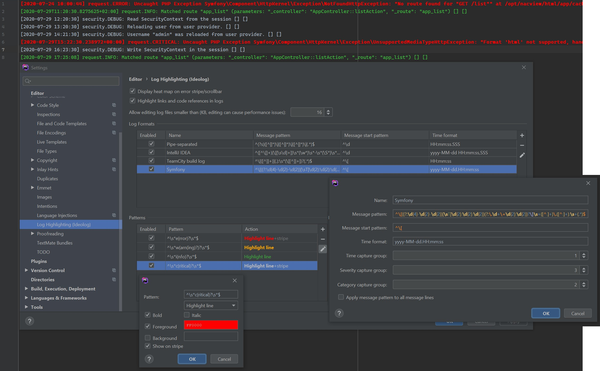
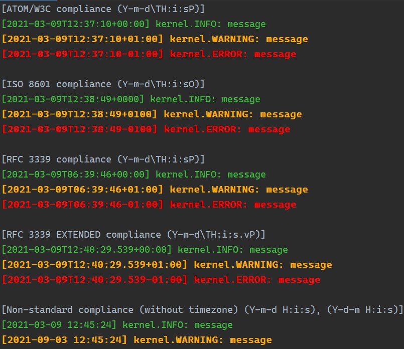

# Cheatsheet for PHPStorm Ideolog Symfony logs format

## Requirements

 * PHPStorm
 * Installed and running **Ideolog** plugin

## Import settings

Easiest way is to import Ideolog settings into your IDE.

1. Download `ideologSymfonyFormat.xml` file.
2. Go to *Settings -> Editor -> Log highlighting (Ideolog)*.
3. Click *Import* button and select downloaded XML file. Activate new pattern if needed.
4. Download or copy/paste `example.log` to test if everything is OK.

## Manual setting up
 1. Go to *Settings -> Editor -> Log highlighting (Ideolog)*.
 2. Add new *Log format* (plus sign on the right of the top list).
 3. Put a name *Symfony* or whatever suits You.
 4. In the field *Message pattern* place this regex: `^\[(\d{4}-\d{2}-\d{2}[T\s]?\d{2}:\d{2}:\d{2}(?:\.\d+)?(?:[\+-]\d{2}:?\d{2})?)]\s+(\w+)\.(\w+):([^\n]*)$`
 5. In the field *Message start pattern* put this regex: `^[\[#]`.
 6. In the field *Time format* put pattern that matches your case, e.g.: `yyyy-MM-dd'T'HH:mm:ss.SSSSSSZ`.
 7. In the field *Time capture group* set number **1**.
 8. In the field *Severity capture group* set number **3**.
 9. In the field *Category capture group* set number **2**.
 10. Push *OK* button. You're almost done!

## Tweaks

### Critical severity
To make *CRITICAL* severity to highlight do following steps:
 1. Go to *Settings -> Editor -> Log highlighting (Ideolog)*.
 2. Add new *Pattern* (plus sign on the right of the bottom-left list).
 3. Enter new pattern: `^\s*c(ritical)?\s*$`
 4. Select newly created pattern on the list and click *Edit* icon on the right.
 5. Under pattern input box, select *highlight line* option.
 6. Check *Foreground*, click on the color field. In new dialog window, at top of the right corner, type red color in hex `#F00` and push *Enter* key.
 7. Uncheck *Background*.
 8. Click *OK* button, close settings and You're done!

#### Here is a screenshot of all actions described above.

#### Test case

